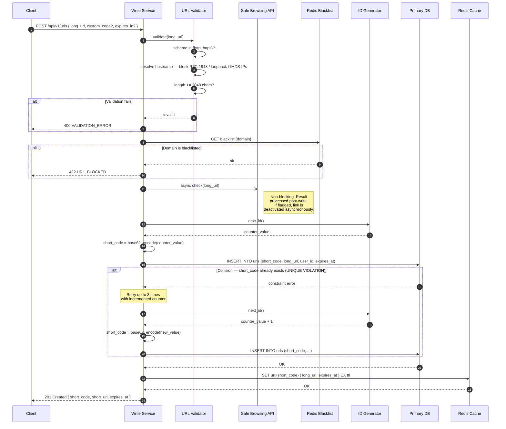
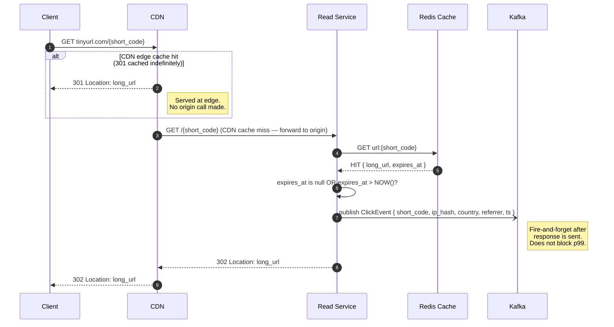
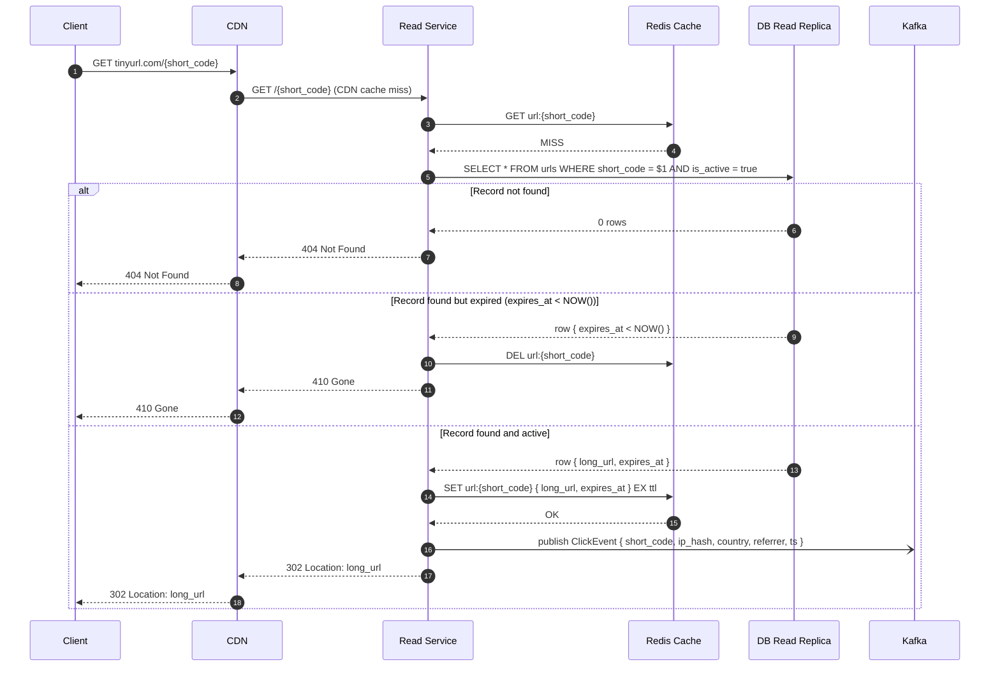
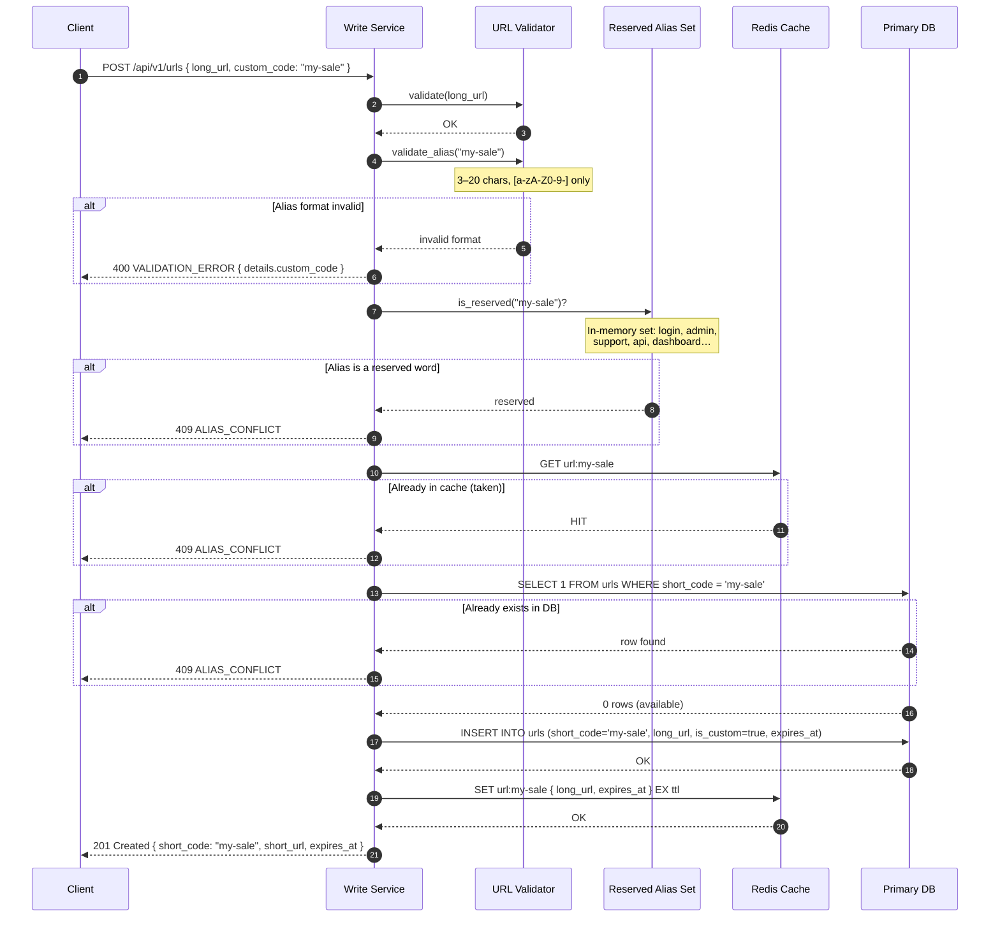
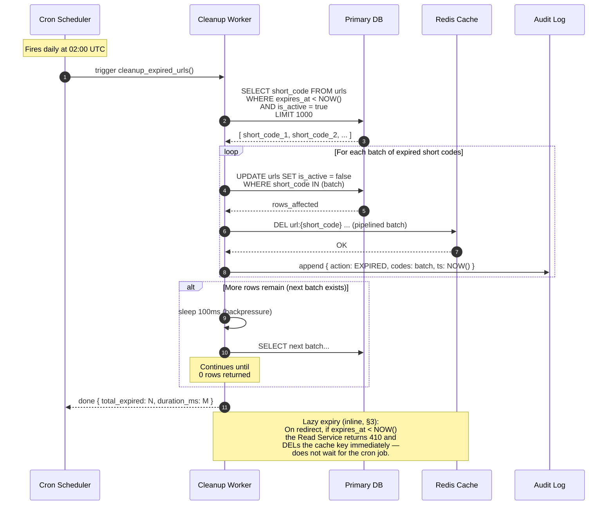
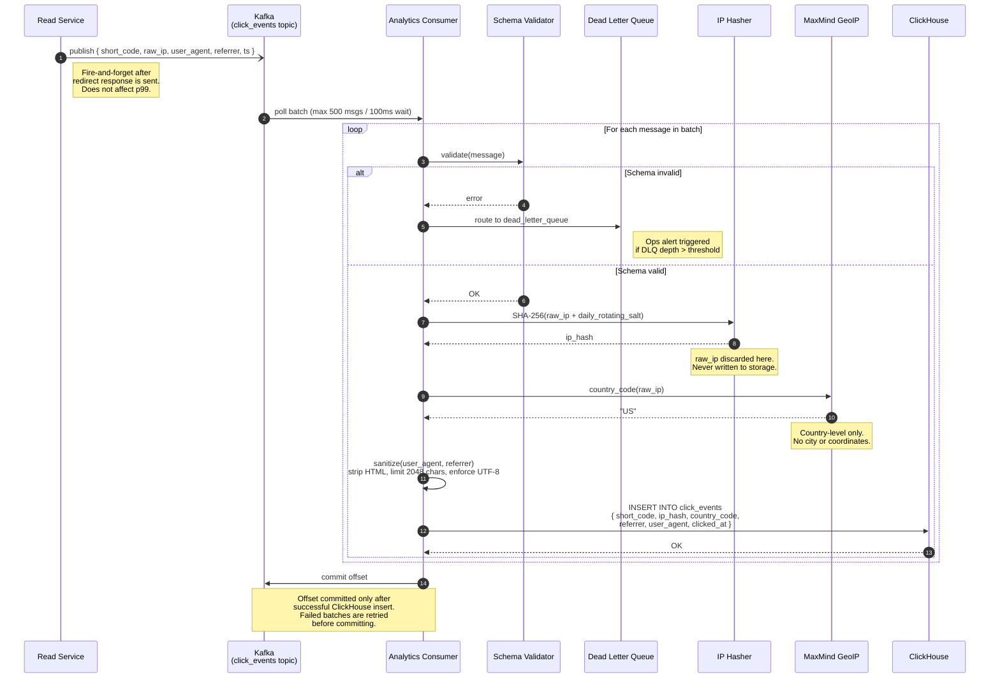
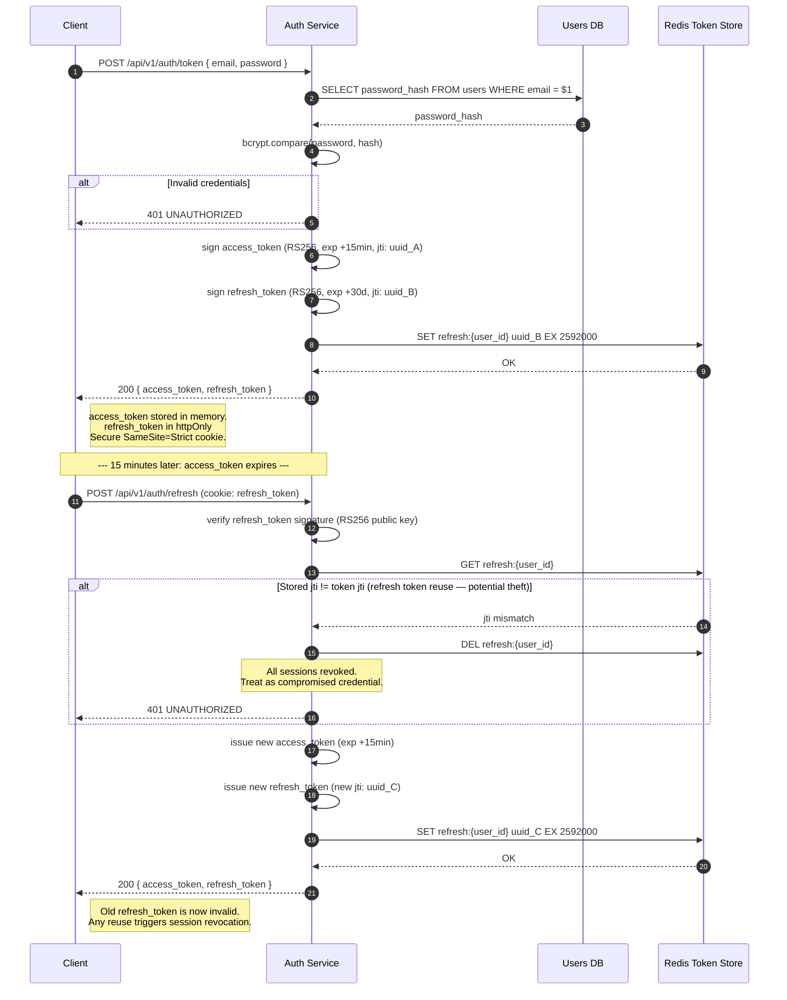

# Sequence Diagrams: TinyURL Service

> Full interaction diagrams for all critical flows.
> Extends the partial ASCII diagrams in [LLD.md §9–10](LLD.md).
> All diagrams use Mermaid `sequenceDiagram` syntax.

---

## 1. Shorten Flow (with Collision Retry)

The write path: client submits a long URL, the service validates it, generates a short code,
persists it, and warms the cache. Collision retry covers the rare case where a generated
code already exists in the DB.

---

## 2. Redirect Flow — Cache Hit

The hot path. No DB or external call. p99 target: < 10 ms.

---

## 3. Redirect Flow — Cache Miss and Expired URL

Two alternate paths from the cache miss branch: record not found, expired, or active.

---

## 4. Custom Alias Creation

Same write path as §1 but the ID generator is replaced by the user-supplied alias,
with an availability check before the DB insert.

---

## 5. URL Expiry Cleanup Job

Background cron that runs nightly. Lazy expiry is also handled inline during redirects
(§3) — this batch job cleans up what lazy expiry leaves behind.

---

## 6. Analytics Ingestion Pipeline

The async path from a click event publish to a queryable ClickHouse row.
This entire pipeline runs off the critical redirect path.

---

## 7. JWT Issue and Refresh Rotation

How a consumer obtains an access token and silently rotates it via the refresh token.

---

## Flow Reference

| # | Flow | Extends |
|---|---|---|
| 1 | Shorten with collision retry | LLD §9, SYSTEM_DESIGN §6 |
| 2 | Redirect — cache hit | LLD §10, SYSTEM_DESIGN §6 |
| 3 | Redirect — cache miss / expired | LLD §10, SYSTEM_DESIGN §6 |
| 4 | Custom alias creation | LLD §7.1, SECURITY B3 |
| 5 | URL expiry cleanup job | LLD §13 |
| 6 | Analytics ingestion pipeline | LLD §4, SYSTEM_DESIGN §6, SECURITY F1 |
| 7 | JWT issue + refresh rotation | API_CONTRACT §3, SECURITY C2 |

---

*Source references: [LLD.md §9–10](LLD.md), [SYSTEM_DESIGN.md §6](SYSTEM_DESIGN.md), [SECURITY.md](SECURITY.md), [API_CONTRACT.md §3](API_CONTRACT.md).*
